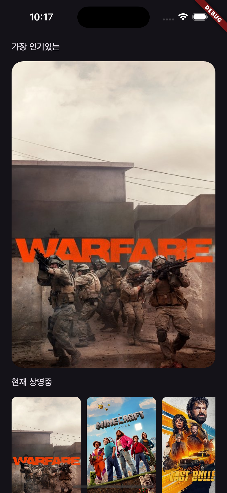
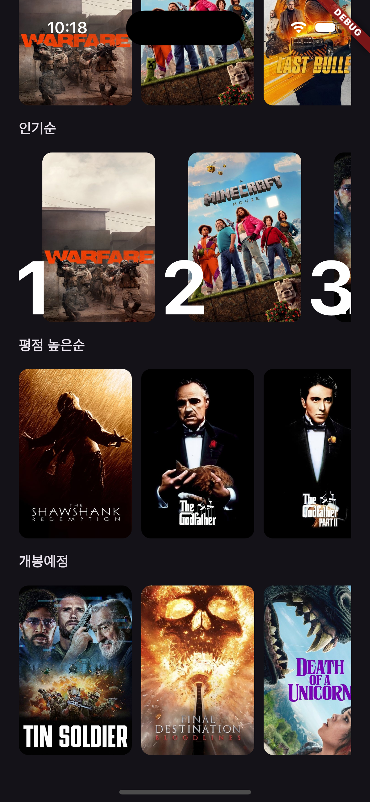
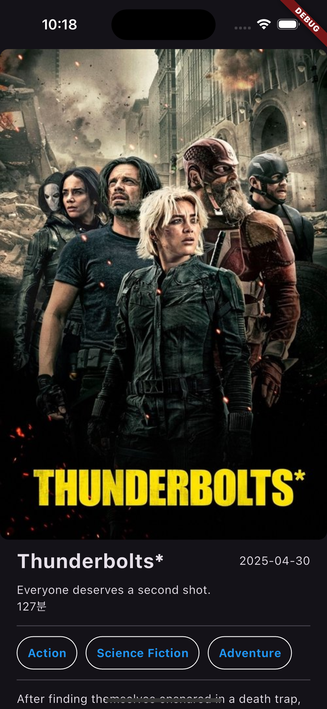
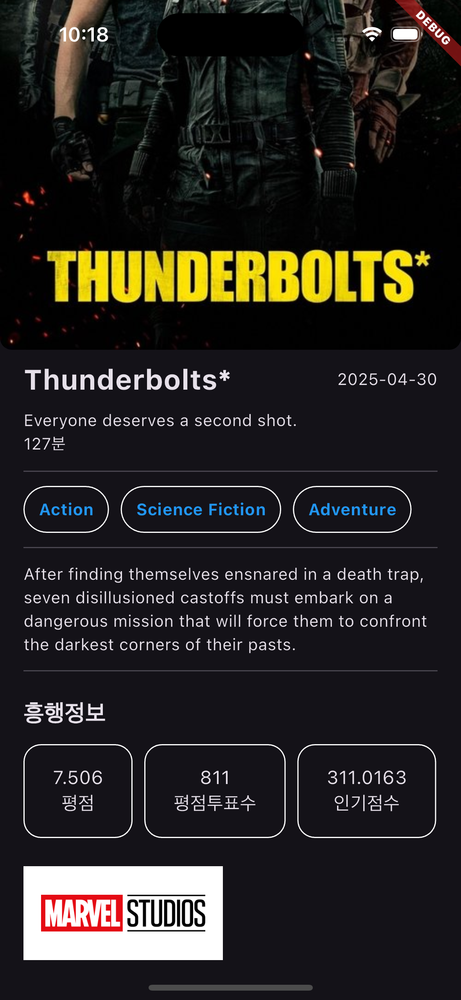

# 영화 정보 앱

## 프로젝트 소개
이 프로젝트는 TMDB api를 이용해 영화 리스트, 상세정보를 보여주는 Flutter 어플리케이션입니다. 유저는 현재 상영중, 인기순, 최고 평점, 곧 개봉할 영화의 리스트를 확인하고 각 영화의 상세정보를 확인할 수 있습니다.

## 스크린샷
<div style="display: flex; overflow-x: auto; border: 2px solid #ccc; padding: 6px; border-radius: 8px;">  
   
    
    
    
  </div>

## 주요 기능
- **영화 리스트 표시**: TMDB api를 이용하여 각 카테고리별 영화 리스트를 표시합니다.
- **영화 상세정보 표시**: TMDB api를 이용하여 사용자가 선택한 영화의 상세 정보를 표시합니다.

## 프로젝트 구조
```
lib
├─ core
│  └─ util.dart                           # 유틸 함수
├─ data                                   # 데이터 계층
│  ├─ data_source                         # 데이터 소스
│  │  ├─ movie_api_data_source_impl.dart
│  │  └─ movie_data_source.dart
│  ├─ dto                                 # DTO 클래스들
│  │  ├─ movie_detail_dto.dart
│  │  └─ movie_response_dto.dart
│  └─ repository                          # 데이터 저장소 구현
│     └─ movie_repository_impl.dart
├─ domain                                 # 도메인 계층
│  ├─ entity                              # 엔티티 정의
│  │  ├─ movie_detail.dart
│  │  └─ movie.dart
│  ├─ repository                          # 도메인 레포지토리 인터페이스
│  │  └─ movie_repository.dart
│  └─ usecase                             # 유즈케이스들
│     ├─ fetch_movie_detail_usecase.dart
│     ├─ fetch_now_playing_movies_usecase.dart
│     ├─ fetch_popular_movies_usecase.dart
│     ├─ fetch_top_rated_movies_usecase.dart
│     └─ fetch_upcoming_movies_usecase.dart
├─ network                                # 네트워크 관련
│  ├─ auth_interceptor.dart
│  └─ dio_client.dart
├─ presentation                           # 프레젠테이션 계층
│  ├─ pages
│  │  ├─ detail                           # 상세 페이지
│  │  │  ├─ widgets
│  │  │  │  ├─ detail_horizontal_list.dart
│  │  │  │  ├─ item_builders.dart
│  │  │  ├─ detail_page.dart
│  │  │  └─ detail_view_model.dart
│  │  └─ home                             # 홈 페이지
│  │     ├─ widgets
│  │     │  ├─ home_horizontal_list.dart
│  │     │  └─ item_builders.dart
│  │     ├─ home_page.dart
│  │     └─ home_view_model.dart
├─ providers.dart                         # Provider 정의
└─ main.dart                              # 앱 시작점
```
 - 클린 아키텍처 구조를 사용해 의존성 방향을 준수하며 구현함

## 의존성 패키지
프로젝트에서 사용한 주요 패키지:
 - flutter_riverpot
 - dio
 - flutter_dotenv
  
## 사용한 오픈 API
 - TMDB Movie lists (NowPlaying, Popular, TopRated, Upcoming)
 - TMDB Movie details

## 트러블슈팅
**뷰모델 테스트 실패**
- 문제점 : 뷰모델 메서드 실행 전과 실행 후의 결과가 null로 같음
- 해결책 : 의도와 달리 프로바이더 호출 시 메서드가 이미 호출되어 실행되는 것을 확인, 프로바이더 호출 시점을 조정하여 테스트 통과

**dto 테스트 실패**
- 문제점 : null은 String의 subtype이 될 수 없다는 에러메세지와 함께 테스트 실패
- 해결책 : quickType을 사용하여 dto를 만들며 iso_633_1과 같은 스트링이 iso6331 형태로 변환될 때 확인하지 못하고 넘어감, fromJson을 수정하여 문제 해결
